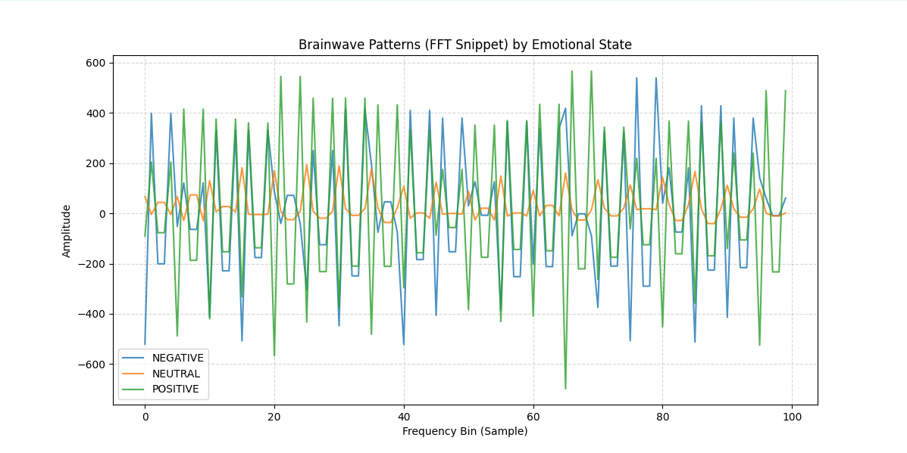

## Project Portfolio

### 1. EEG Emotion Decoding 
This project aims to classify human emotional states (Positive, Negative, Neutral) from brainwave activity using EEG signal data.

#### Dataset
The dataset consists of EEG brainwave recordings that capture the electrical activity of the brain while subjects experience specific emotional triggers.
- **Source:** Muse EEG Dataset (via Kaggle)
- **Features:** 2,549 features including statistical measures and **FFT (Fast Fourier Transform)** bins.
- **Labels:** 3 Emotional Classes (Neutral, Positive, Negative).

#### Methodology & Technical Stack
- **Preprocessing:** Label Encoding, Column Normalization, and Signal Cleaning.
- **Feature Exploration:** Frequency distribution analysis using FFT to identify neural patterns.
- **Model:** Random Forest Classifier (serving as a robust baseline for high-dimensional data).
- **Architecture:** Implemented using **Object-Oriented Programming (OOP)** principles in Python for scalability.

#### Results & Performance
The model currently achieves an accuracy of **~98%** in distinguishing emotional states on the test set, demonstrating the high separability of neural frequency patterns.

## Data Setup

Due to GitHub's file size limitations, the raw dataset (`emotions.csv`) is not included in this repository. To run the analysis, please follow these steps:

1. Download the dataset from Kaggle: [EEG Brainwave Dataset: Feeling Emotions](https://www.kaggle.com/datasets/birdy654/eeg-brainwave-dataset-feeling-emotions).
2. Extract the downloaded ZIP file.
3. Rename the CSV file to `emotions.csv` (if it has a different name).
4. Place the file in the same directory as the `emotions.py` script.

